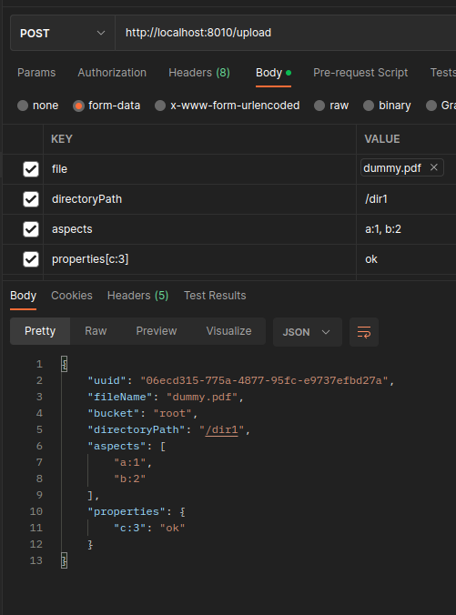

# Document Storage (S3 compliant)

## Features

- Document type
- Document aspects
- Document properties
- Search in type, aspects, properties
- File versioning
- File content indexation (TODO)

## DEV

### Upload a document from Postman



### Bulk upload (seeding)

```bash
./upload.sh /media/DATA/workspace/DEV/_WKS_PDF_SIGN/pdf-sign/src/main/resources/dummy.pdf 3 
```

### Query exemple

```text
GET node/_search
{
  "query": {
    "bool": {
      "must": [
        {
          "match": {
            "aspects": "app-doc:fruit"
          }
        },
        {
          "match": {
            "uuid": "dafbe1a2-c9f0-4067-922c-5f77fbf8de6d"
          }
        }
      ]
    }
  }
}
```
